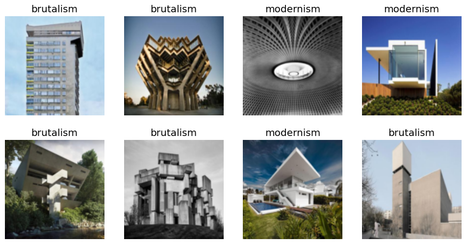

```python
import os
iskaggle = os.environ.get('KAGGLE_KERNEL_RUN_TYPE', '')

if iskaggle:
    !pip install -Uqq fastbook fastai duckduckgo_search;
```


```python
# import packages
import fastbook
from fastbook import *
fastbook.setup_book()
from fastai.vision.widgets import *
from duckduckgo_search import DDGS
from fastcore.all import *
```


```python
# test set
architecture_styles = ['brutalism', 'modernism']

image_urls = {
    'brutalism': 'https://scontent.fsof8-1.fna.fbcdn.net/v/t39.30808-6/348926828_199702382963480_5292274693759943130_n.jpg?stp=cp6_dst-jpg&_nc_cat=111&ccb=1-7&_nc_sid=173fa1&_nc_ohc=0TMBwpZS7DcAX954E_3&_nc_ht=scontent.fsof8-1.fna&oh=00_AfD_VwBdTT4pI6MPzVQxxAbuZgUn9zrm22dxuEwhwovayQ&oe=65E8EE8C',
    'modernism': 'https://architecturehereandthere.files.wordpress.com/2015/06/awesome-architecture-buildings.jpg'
}

destinations = {
    'brutalism': 'images/brutalism.jpg',
    'modernism': 'images/modernism.jpg'
}
```


```python
# download the test set images
for url in image_urls:
    download_url(image_urls[url], destinations[url])
```


<style>
    /* Turns off some styling */
    progress {
        /* gets rid of default border in Firefox and Opera. */
        border: none;
        /* Needs to be in here for Safari polyfill so background images work as expected. */
        background-size: auto;
    }
    progress:not([value]), progress:not([value])::-webkit-progress-bar {
        background: repeating-linear-gradient(45deg, #7e7e7e, #7e7e7e 10px, #5c5c5c 10px, #5c5c5c 20px);
    }
    .progress-bar-interrupted, .progress-bar-interrupted::-webkit-progress-bar {
        background: #F44336;
    }
</style>


<div>
  <progress value='73728' class='' max='71212' style='width:300px; height:20px; vertical-align: middle;'></progress>
  103.53% [73728/71212 00:00&lt;00:00]
</div>


<style>
    /* Turns off some styling */
    progress {
        /* gets rid of default border in Firefox and Opera. */
        border: none;
        /* Needs to be in here for Safari polyfill so background images work as expected. */
        background-size: auto;
    }
    progress:not([value]), progress:not([value])::-webkit-progress-bar {
        background: repeating-linear-gradient(45deg, #7e7e7e, #7e7e7e 10px, #5c5c5c 10px, #5c5c5c 20px);
    }
    .progress-bar-interrupted, .progress-bar-interrupted::-webkit-progress-bar {
        background: #F44336;
    }
</style>


<div>
  <progress value='122880' class='' max='121554' style='width:300px; height:20px; vertical-align: middle;'></progress>
  101.09% [122880/121554 00:00&lt;00:00]
</div>


```python
# use DuckDuckGo search to download images
def search_images(term, max_image=100):
    print(f"Searching for '{term}'")
    return L(DDGS().images(term, max_results=max_image)).itemgot('image')

path = Path('styles')
from time import sleep

for i in architecture_styles:
    dest = (path/i)
    dest.mkdir(exist_ok=True, parents=True)
    download_images(dest, urls=search_images(f'{i} architecture'))
    sleep(10)
    resize_images(path/i, max_size=400, dest=path/i)
```

    Searching for 'brutalism architecture'
    Searching for 'modernism architecture'


```python
# remove images that cannot be opened
failed = verify_images(get_image_files(path))
failed.map(Path.unlink)
len(failed)
```


    4


```python
# how many images we're going to train the model on
image_files = get_image_files(path)
len(image_files)
```


    193


```python
# create datablock
buildings = DataBlock(
    blocks = (ImageBlock, CategoryBlock),
    get_items = get_image_files,
    splitter = RandomSplitter(valid_pct=0.2, seed=42),
    get_y = parent_label,
    item_tfms=Resize(128, ResizeMethod.Squish)
)
```


```python
dls = buildings.dataloaders(path)
dls.valid.show_batch(max_n=8, nrows=2)
```





```python
learn = vision_learner(dls, resnet18, metrics=error_rate)
learn.fine_tune(7)
```


<style>
    /* Turns off some styling */
    progress {
        /* gets rid of default border in Firefox and Opera. */
        border: none;
        /* Needs to be in here for Safari polyfill so background images work as expected. */
        background-size: auto;
    }
    progress:not([value]), progress:not([value])::-webkit-progress-bar {
        background: repeating-linear-gradient(45deg, #7e7e7e, #7e7e7e 10px, #5c5c5c 10px, #5c5c5c 20px);
    }
    .progress-bar-interrupted, .progress-bar-interrupted::-webkit-progress-bar {
        background: #F44336;
    }
</style>


<table border="1" class="dataframe">
  <thead>
    <tr style="text-align: left;">
      <th>epoch</th>
      <th>train_loss</th>
      <th>valid_loss</th>
      <th>error_rate</th>
      <th>time</th>
    </tr>
  </thead>
  <tbody>
    <tr>
      <td>0</td>
      <td>1.503708</td>
      <td>1.029500</td>
      <td>0.473684</td>
      <td>00:07</td>
    </tr>
  </tbody>
</table>


<style>
    /* Turns off some styling */
    progress {
        /* gets rid of default border in Firefox and Opera. */
        border: none;
        /* Needs to be in here for Safari polyfill so background images work as expected. */
        background-size: auto;
    }
    progress:not([value]), progress:not([value])::-webkit-progress-bar {
        background: repeating-linear-gradient(45deg, #7e7e7e, #7e7e7e 10px, #5c5c5c 10px, #5c5c5c 20px);
    }
    .progress-bar-interrupted, .progress-bar-interrupted::-webkit-progress-bar {
        background: #F44336;
    }
</style>


<table border="1" class="dataframe">
  <thead>
    <tr style="text-align: left;">
      <th>epoch</th>
      <th>train_loss</th>
      <th>valid_loss</th>
      <th>error_rate</th>
      <th>time</th>
    </tr>
  </thead>
  <tbody>
    <tr>
      <td>0</td>
      <td>0.985326</td>
      <td>0.904235</td>
      <td>0.421053</td>
      <td>00:07</td>
    </tr>
    <tr>
      <td>1</td>
      <td>0.841009</td>
      <td>0.707181</td>
      <td>0.394737</td>
      <td>00:07</td>
    </tr>
    <tr>
      <td>2</td>
      <td>0.653282</td>
      <td>0.518229</td>
      <td>0.263158</td>
      <td>00:08</td>
    </tr>
    <tr>
      <td>3</td>
      <td>0.530516</td>
      <td>0.467340</td>
      <td>0.210526</td>
      <td>00:10</td>
    </tr>
    <tr>
      <td>4</td>
      <td>0.424877</td>
      <td>0.443567</td>
      <td>0.157895</td>
      <td>00:08</td>
    </tr>
    <tr>
      <td>5</td>
      <td>0.362354</td>
      <td>0.412099</td>
      <td>0.131579</td>
      <td>00:09</td>
    </tr>
    <tr>
      <td>6</td>
      <td>0.312246</td>
      <td>0.390802</td>
      <td>0.105263</td>
      <td>00:07</td>
    </tr>
  </tbody>
</table>


```python
# use our model on the test set
brutalism = destinations['brutalism']
modernism = destinations['modernism']
image = brutalism

architecture_style,_,probs = learn.predict(image)
print(f'Architectural style: {architecture_style}')
Image.open(image).to_thumb(256)
```


<style>
    /* Turns off some styling */
    progress {
        /* gets rid of default border in Firefox and Opera. */
        border: none;
        /* Needs to be in here for Safari polyfill so background images work as expected. */
        background-size: auto;
    }
    progress:not([value]), progress:not([value])::-webkit-progress-bar {
        background: repeating-linear-gradient(45deg, #7e7e7e, #7e7e7e 10px, #5c5c5c 10px, #5c5c5c 20px);
    }
    .progress-bar-interrupted, .progress-bar-interrupted::-webkit-progress-bar {
        background: #F44336;
    }
</style>


    Architectural style: brutalism


