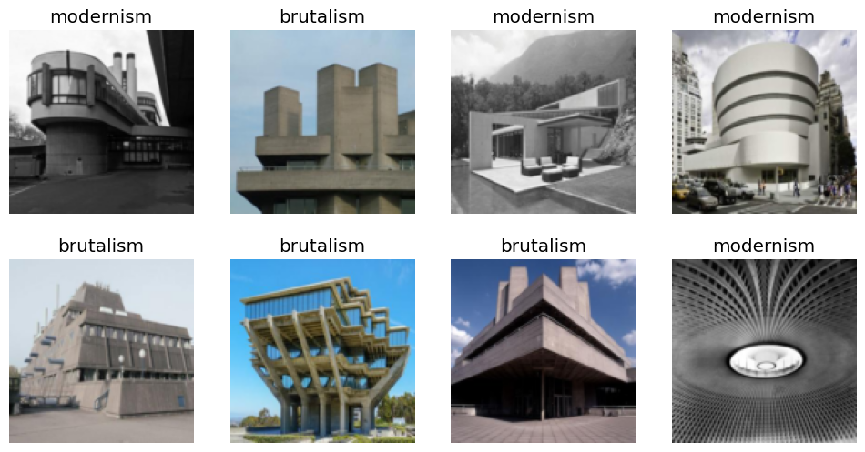
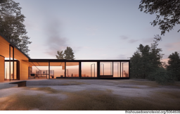

```python
dls = buildings.dataloaders(path)
dls.valid.show_batch(max_n=8, nrows=2)
```





```python
learn = vision_learner(dls, resnet18, metrics=error_rate)
learn.fine_tune(10)
```


<table border="1" class="dataframe">
  <thead>
    <tr style="text-align: left;">
      <th>epoch</th>
      <th>train_loss</th>
      <th>valid_loss</th>
      <th>error_rate</th>
      <th>time</th>
    </tr>
  </thead>
  <tbody>
    <tr>
      <td>0</td>
      <td>1.615729</td>
      <td>1.096224</td>
      <td>0.562500</td>
      <td>00:07</td>
    </tr>
  </tbody>
</table>


<table border="1" class="dataframe">
  <thead>
    <tr style="text-align: left;">
      <th>epoch</th>
      <th>train_loss</th>
      <th>valid_loss</th>
      <th>error_rate</th>
      <th>time</th>
    </tr>
  </thead>
  <tbody>
    <tr>
      <td>0</td>
      <td>1.016636</td>
      <td>0.961717</td>
      <td>0.468750</td>
      <td>00:08</td>
    </tr>
    <tr>
      <td>1</td>
      <td>0.805441</td>
      <td>0.843640</td>
      <td>0.406250</td>
      <td>00:09</td>
    </tr>
    <tr>
      <td>2</td>
      <td>0.635115</td>
      <td>1.023298</td>
      <td>0.375000</td>
      <td>00:08</td>
    </tr>
    <tr>
      <td>3</td>
      <td>0.509113</td>
      <td>1.047415</td>
      <td>0.343750</td>
      <td>00:08</td>
    </tr>
    <tr>
      <td>4</td>
      <td>0.421787</td>
      <td>1.013373</td>
      <td>0.312500</td>
      <td>00:08</td>
    </tr>
    <tr>
      <td>5</td>
      <td>0.347252</td>
      <td>0.977353</td>
      <td>0.250000</td>
      <td>00:09</td>
    </tr>
    <tr>
      <td>6</td>
      <td>0.295770</td>
      <td>0.945430</td>
      <td>0.250000</td>
      <td>00:09</td>
    </tr>
    <tr>
      <td>7</td>
      <td>0.255178</td>
      <td>0.896436</td>
      <td>0.250000</td>
      <td>00:08</td>
    </tr>
    <tr>
      <td>8</td>
      <td>0.225590</td>
      <td>0.860104</td>
      <td>0.218750</td>
      <td>00:08</td>
    </tr>
    <tr>
      <td>9</td>
      <td>0.199565</td>
      <td>0.830705</td>
      <td>0.218750</td>
      <td>00:08</td>
    </tr>
  </tbody>
</table>


    Architectural style: brutalism



