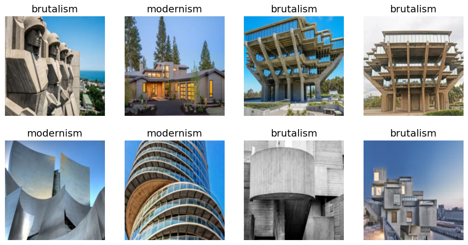
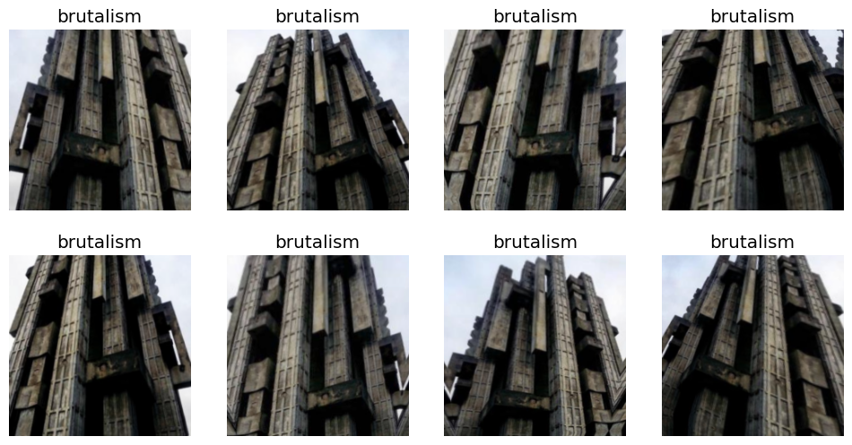
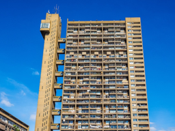

```python
dls.valid.show_batch(max_n=8, nrows=2)
```





```python
dls.train.show_batch(max_n=8, nrows=2, unique=True)
```





```python
learn = vision_learner(dls, resnet18, metrics=error_rate)
learn.fine_tune(20)
```


<table border="1" class="dataframe">
  <thead>
    <tr style="text-align: left;">
      <th>epoch</th>
      <th>train_loss</th>
      <th>valid_loss</th>
      <th>error_rate</th>
      <th>time</th>
    </tr>
  </thead>
  <tbody>
    <tr>
      <td>0</td>
      <td>1.437171</td>
      <td>0.996425</td>
      <td>0.333333</td>
      <td>00:09</td>
    </tr>
  </tbody>
</table>


<table border="1" class="dataframe">
  <thead>
    <tr style="text-align: left;">
      <th>epoch</th>
      <th>train_loss</th>
      <th>valid_loss</th>
      <th>error_rate</th>
      <th>time</th>
    </tr>
  </thead>
  <tbody>
    <tr>
      <td>0</td>
      <td>0.866592</td>
      <td>0.685026</td>
      <td>0.315789</td>
      <td>00:11</td>
    </tr>
    <tr>
      <td>1</td>
      <td>0.743727</td>
      <td>0.558441</td>
      <td>0.175439</td>
      <td>00:11</td>
    </tr>
    <tr>
      <td>2</td>
      <td>0.666081</td>
      <td>0.501971</td>
      <td>0.140351</td>
      <td>00:11</td>
    </tr>
    <tr>
      <td>3</td>
      <td>0.594426</td>
      <td>0.506327</td>
      <td>0.157895</td>
      <td>00:11</td>
    </tr>
    <tr>
      <td>4</td>
      <td>0.516933</td>
      <td>0.473478</td>
      <td>0.157895</td>
      <td>00:11</td>
    </tr>
    <tr>
      <td>5</td>
      <td>0.459950</td>
      <td>0.450391</td>
      <td>0.122807</td>
      <td>00:12</td>
    </tr>
    <tr>
      <td>6</td>
      <td>0.419639</td>
      <td>0.402630</td>
      <td>0.122807</td>
      <td>00:12</td>
    </tr>
    <tr>
      <td>7</td>
      <td>0.374230</td>
      <td>0.396566</td>
      <td>0.140351</td>
      <td>00:12</td>
    </tr>
    <tr>
      <td>8</td>
      <td>0.345551</td>
      <td>0.352917</td>
      <td>0.140351</td>
      <td>00:11</td>
    </tr>
    <tr>
      <td>9</td>
      <td>0.315481</td>
      <td>0.334553</td>
      <td>0.105263</td>
      <td>00:12</td>
    </tr>
    <tr>
      <td>10</td>
      <td>0.285079</td>
      <td>0.347992</td>
      <td>0.122807</td>
      <td>00:11</td>
    </tr>
    <tr>
      <td>11</td>
      <td>0.257463</td>
      <td>0.368489</td>
      <td>0.140351</td>
      <td>00:12</td>
    </tr>
    <tr>
      <td>12</td>
      <td>0.235223</td>
      <td>0.375812</td>
      <td>0.140351</td>
      <td>00:12</td>
    </tr>
    <tr>
      <td>13</td>
      <td>0.218762</td>
      <td>0.377232</td>
      <td>0.140351</td>
      <td>00:11</td>
    </tr>
    <tr>
      <td>14</td>
      <td>0.203787</td>
      <td>0.386949</td>
      <td>0.140351</td>
      <td>00:12</td>
    </tr>
    <tr>
      <td>15</td>
      <td>0.192760</td>
      <td>0.393861</td>
      <td>0.122807</td>
      <td>00:11</td>
    </tr>
    <tr>
      <td>16</td>
      <td>0.191696</td>
      <td>0.394920</td>
      <td>0.122807</td>
      <td>00:12</td>
    </tr>
    <tr>
      <td>17</td>
      <td>0.178989</td>
      <td>0.396216</td>
      <td>0.122807</td>
      <td>00:12</td>
    </tr>
    <tr>
      <td>18</td>
      <td>0.167178</td>
      <td>0.397290</td>
      <td>0.122807</td>
      <td>00:15</td>
    </tr>
    <tr>
      <td>19</td>
      <td>0.158060</td>
      <td>0.384972</td>
      <td>0.122807</td>
      <td>00:17</td>
    </tr>
  </tbody>
</table>


    Architectural style: brutalism





